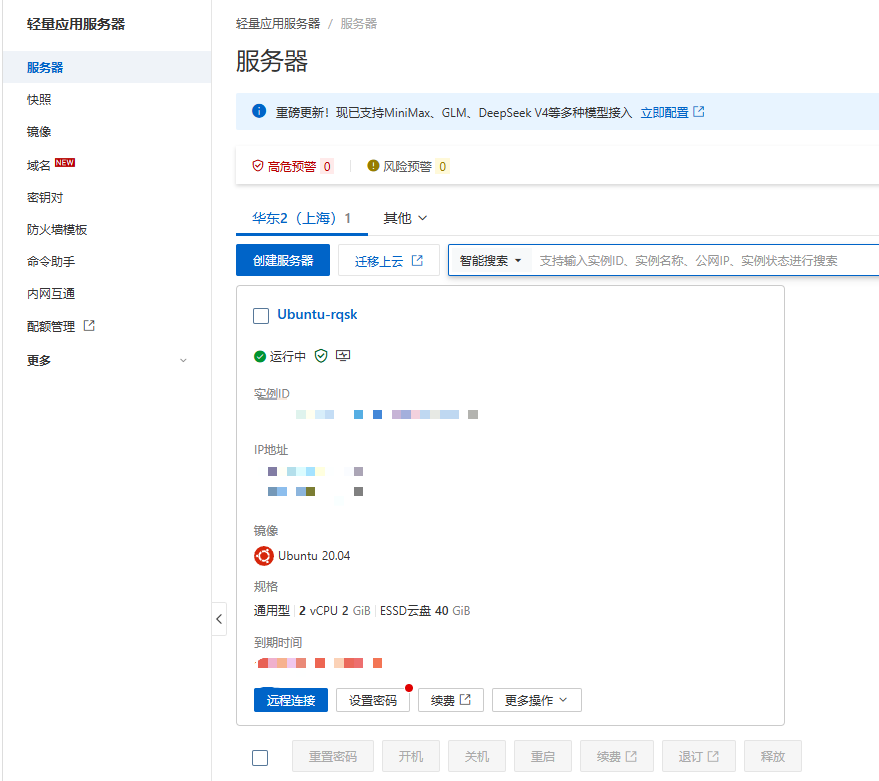
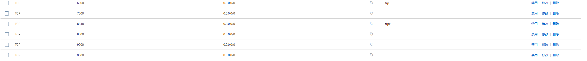
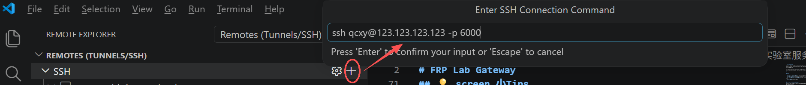
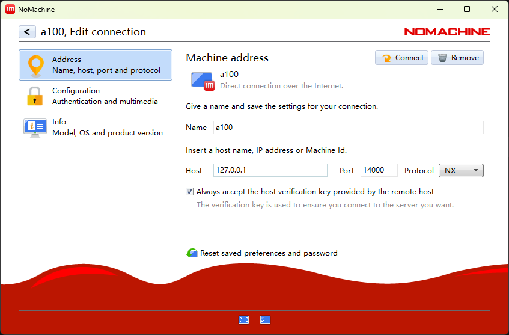

# FRP Lab Gateway

本仓库用于记录实验室服务器内网穿透的部署流程，主要基于 [frp](https://github.com/fatedier/frp) 实现 SSH、NoMachine、Web 服务等远程访问功能。

通过该方案，可以将实验室内网服务器的指定端口映射到一台具有公网 IP 的云服务器上，从而在校外或异地环境下访问实验室服务器。

---

## 目录

- [1. 公网 IP 机器的购买与准备](#1-公网-ip-机器的购买与准备)
- [2. frp 文件下载与配置](#2-frp-文件下载与配置)
- [3. 如何使用内网穿透](#3-如何使用内网穿透)
- [4. 使用 NoMachine 远程连接服务器](#4-使用-nomachine-远程连接服务器)

---

## 1. 公网 IP 机器的购买与准备
以阿里云为例购买服务器为例，每年有300块的学生优惠券，实测买最便宜的服务器可以白嫖半年


---

## 2. frp 文件下载与配置

### 2.1 官方主页下载 frp

进入 frp 官方 Release 页面下载对应系统版本：

[https://github.com/fatedier/frp/releases](https://github.com/fatedier/frp/releases)

Linux x86_64 服务器一般下载类似：

```text
frp_x.x.x_linux_amd64.tar.gz
```

解压：

```bash
tar -xzf frp_x.x.x_linux_amd64.tar.gz
cd frp_x.x.x_linux_amd64
```
### 2.2 直接使用
当前项目的frp文件夹中，把frps、frps.toml上传到公网服务器，frpc、frpc.toml保留到想进行内网穿透的两台或多台机器中

---
### 2.3 服务器端配置
对应的frps.toml仅需要做的就是自行修改auth.token关键字，相关请参考：[frps.toml](frp/frps.toml)

```bash
cd frps所在文件夹
screen -S frps ./frps -c frps.toml 
```
screen为额外工具，可以在关掉终端的前提下运行命令，不想下载这个工具执行
```bash
cd frps所在文件夹
frps ./frps -c frps.toml 
```
成功后会出现类似提示
```bash
[frps/root.go:105] frps uses config file: frps.toml
[server/service.go:237] frps tcp listen on 0.0.0.0:7000
[server/service.go:305] http service listen on 0.0.0.0:80
[server/service.go:319] https service listen on 0.0.0.0:443
[frps/root.go:114] frps started successfully
[server/service.go:351] dashboard listen on 0.0.0.0:7500
```
## 💡 screen 小Tips
1. 创建 screen 会话

   ```bash
   screen -S frp
   ```

2. 退出但不关闭任务

   ```text
   Ctrl + A，然后按 D
   ```

3. 重新进入 screen 会话

   ```bash
   screen -r frp
   ```
4. 查看当前有哪些 screen 会话

   ```bash
   screen -ls
   ```

---

### 2.3 客户端配置
frpc.toml需要修改关键字为serverAddr(公网IP)、auth.token(必须与服务器端一致)、name(连接方便)、remotePort(随便一个空端口，以6000为例)，相关请参考：[frpc.toml](frp/frpc.toml)

```bash
cd frpc所在文件夹
screen -S frpc ./frpc -c frpc.toml 
```

---

## 3. 如何使用内网穿透
首先要先把在frpc.toml中设置的remotePort在服务器的防火墙中允许访问

### 3.1 通过 SSH 连接实验室服务器

假设 `frpc.toml` 中相关映射与[frpc.toml](frp/frpc.toml)相同

则在本地电脑中执行：

```bash
ssh 用户名@公网服务器IP -p 6000
```

示例：

```bash
ssh qcxy@123.123.123.123 -p 6000
```

这里的 `qcxy` 是内网服务器上的 Linux 用户名，不是公网服务器用户名。

---

### 3.2 通过vscode的remote-ssh插件
下载完插件按以下步骤即可连接


### ⚠️ 强烈建议
1.在已连接的基础上进行免密连接设置，防止因为网络波动等原因掉线

2.远程连接进行代码调试，如果连接中断则相对应运行程序也会中断

如果在安装过程中出现问题，可参考[博客](https://www.cnblogs.com/geek233/p/18791892)或ai

---

## 4. 使用 NoMachine 远程连接服务器
如果因为某些原因无法使用向日葵或TOdesk等软件进行远程操作，可使用内网穿透搭配NoMachine进行远程操作

### 4.1 服务器端检查 NoMachine

在实验室服务器上执行：

```bash
sudo /usr/NX/bin/nxserver --status
```

正常情况下应看到类似：

```text
NX> 111 New connections to NoMachine server are enabled.
NX> 161 Enabled service: nxserver.
NX> 162 Enabled service: nxnode.
NX> 162 Enabled service: nxd.
```

---


### 4.2 使用 SSH 隧道连接 NoMachine

在本地电脑执行：

```bash
ssh -N -L 14000:127.0.0.1:4000 用户名@公网服务器IP -p 6000
```

保持该终端窗口不要关闭。

然后 NoMachine 中：



这种方式的链路为：

```text
NoMachine -> 本地 127.0.0.1:14000 -> SSH 隧道 -> 实验室服务器 127.0.0.1:4000
```

---
